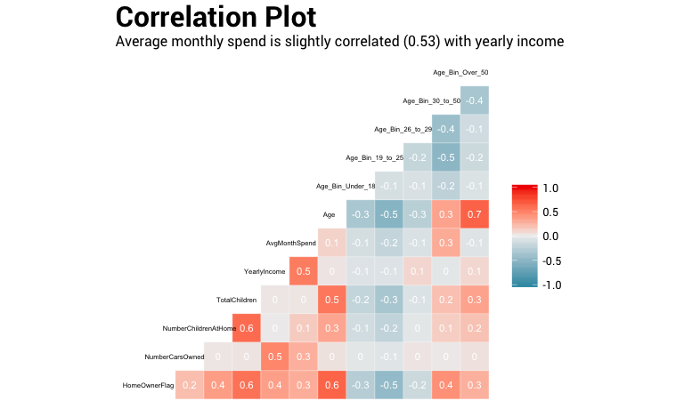
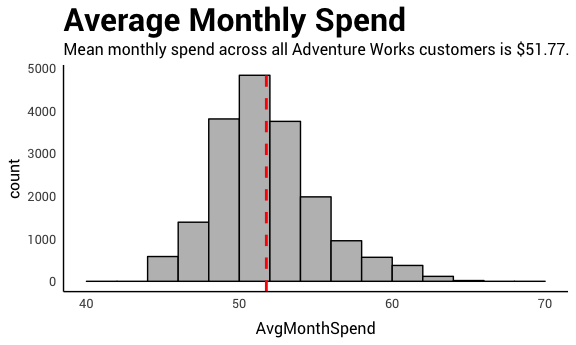
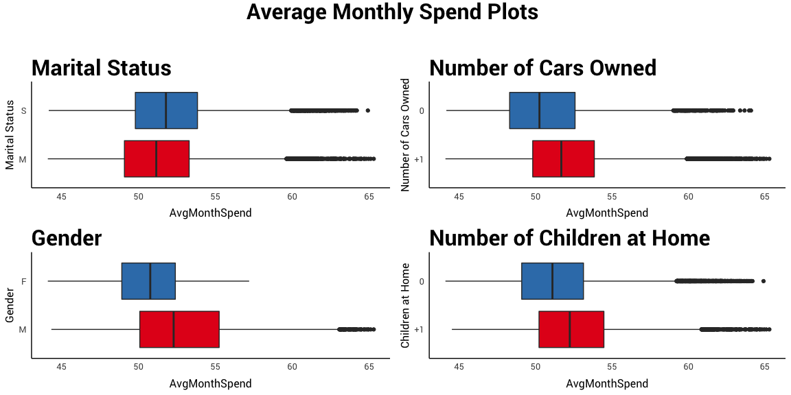
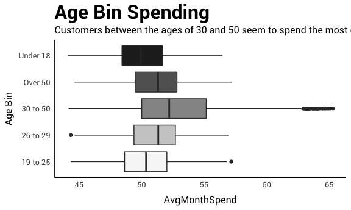
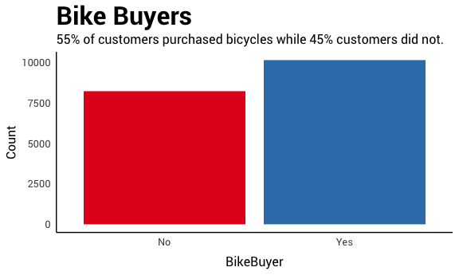
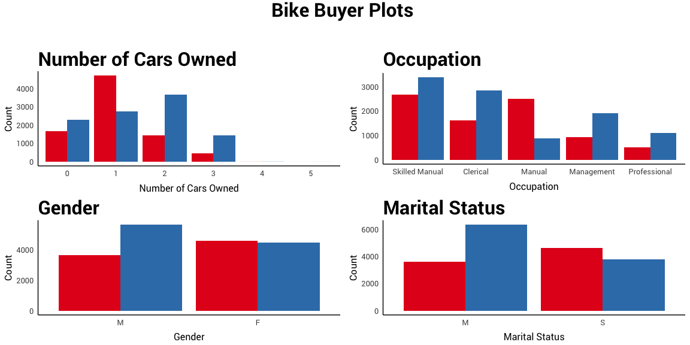
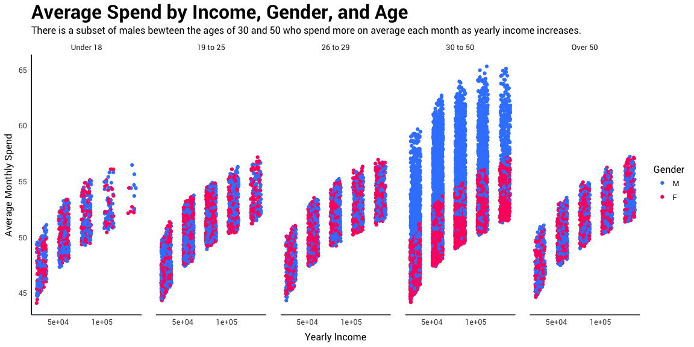
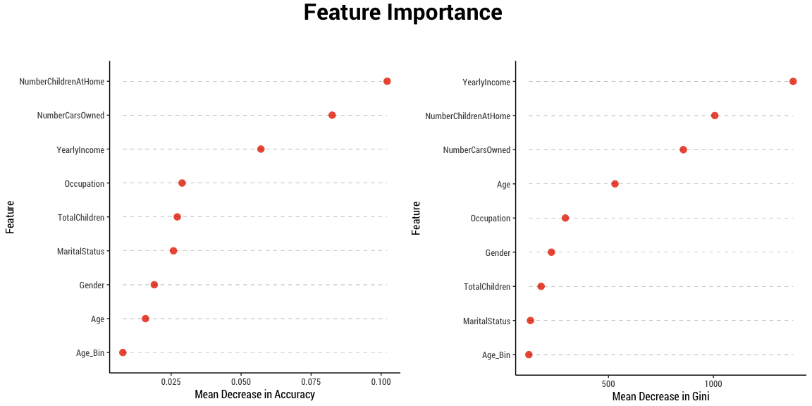

# Adventure Works Cycle Customer Analysis
Carl Centola  
11/7/2017  


## Business Problem
The goal of this analysis is to use features in Adventure Works Cycle customer and sales data to predict whether or not a customer will purchase a bicycle. Using the same data, Adventure Works would also like to predict how much money, on average, a customer will spend in a given month across all product categories.

### Process
Exploratory data analysis, calculation of summary and descriptive statistics, and visualizations are all methods used to identify relationships between the data and the features of interest: bike buyer classification and average monthly spend. Once relationships are identified, a classification model will prove useful in predicting if a customer will purchase a bicycle. Finally, a regression model will assist in predicting the average amount of money a customer will spend in a given month.


## Data

Adventure Works provided two separate datasets: one containing customer demographic data and one containing sales data. The initial customer data contained 18361 observations and 24 features. The sales data contained 18355 and 3 features. The structure of each of these datasets is as follows:


```
## Classes 'tbl_df', 'tbl' and 'data.frame':	18361 obs. of  24 variables:
##  $ CustomerID          : int  21173 13249 29350 13503 22803 22092 11229 24179 12127 19903 ...
##  $ Title               : chr  "NULL" "NULL" "NULL" "NULL" ...
##  $ FirstName           : chr  "Chad" "Ryan" "Julia" "Theodore" ...
##  $ MiddleName          : chr  "C" "NULL" "NULL" "NULL" ...
##  $ LastName            : chr  "Yuan" "Perry" "Thompson" "Gomez" ...
##  $ Suffix              : chr  "NULL" "NULL" "NULL" "NULL" ...
##  $ AddressLine1        : chr  "7090 C. Mount Hood" "3651 Willow Lake Rd" "1774 Tice Valley Blvd." "2103 Baldwin Dr" ...
##  $ AddressLine2        : chr  "NULL" "NULL" "NULL" "NULL" ...
##  $ City                : chr  "Wollongong" "Shawnee" "West Covina" "Liverpool" ...
##  $ StateProvinceName   : chr  "New South Wales" "British Columbia" "California" "England" ...
##  $ CountryRegionName   : chr  "Australia" "Canada" "United States" "United Kingdom" ...
##  $ PostalCode          : chr  "2500" "V9B 2C3" "91791" "L4 4HB" ...
##  $ PhoneNumber         : chr  "1 (11) 500 555-0115" "787-555-0136" "120-555-0111" "1 (11) 500 555-0167" ...
##  $ BirthDate           : Date, format: "1987-11-13" "1972-07-21" ...
##  $ Education           : chr  "Bachelors" "Partial College" "Bachelors" "Partial College" ...
##  $ Occupation          : Factor w/ 5 levels "Skilled Manual",..: 3 3 3 1 1 1 2 1 3 2 ...
##  $ Gender              : Factor w/ 2 levels "M","F": 1 1 2 1 1 2 1 2 2 1 ...
##  $ MaritalStatus       : Factor w/ 2 levels "M","S": 1 1 2 1 2 1 2 1 1 2 ...
##  $ HomeOwnerFlag       : int  1 1 0 1 1 1 1 0 1 0 ...
##  $ NumberCarsOwned     : int  3 2 3 2 1 2 1 1 0 1 ...
##  $ NumberChildrenAtHome: int  0 1 0 1 0 2 0 0 0 0 ...
##  $ TotalChildren       : int  1 2 0 2 0 2 0 0 2 0 ...
##  $ YearlyIncome        : int  81916 81076 86387 61481 51804 61944 34919 61832 83834 26880 ...
##  $ LastUpdated         : Date, format: "2017-03-06" "2017-03-06" ...
```

```
## Classes 'tbl_df', 'tbl' and 'data.frame':	18355 obs. of  3 variables:
##  $ CustomerID   : int  21173 13249 29350 13503 22803 22092 11229 24179 12127 19903 ...
##  $ BikeBuyer    : int  1 1 1 1 1 1 0 1 1 0 ...
##  $ AvgMonthSpend: num  51 53.1 54.1 56.9 55.4 ...
```


## Pre-Processing
Data pre-processing is an integral step in any data analysis exercise. Cleaning the raw data is a necessary step to ensure that each of the features in our data is of a useable data type and contains no null values or duplicates. We will also do some feature engineering in this step to create new features that will be of assistance in our visualization and modeling steps.

### Remove Duplicates
The first step when working with customer data is to check for duplicate records and remove them. Using the Customer ID field, it is possible to check for duplicates by finding any ID numbers that appear more than once. 

<div data-pagedtable="false">
  <script data-pagedtable-source type="application/json">
{"columns":[{"label":["CustomerID"],"name":[1],"type":["int"],"align":["right"]},{"label":["Title"],"name":[2],"type":["chr"],"align":["left"]},{"label":["FirstName"],"name":[3],"type":["chr"],"align":["left"]},{"label":["MiddleName"],"name":[4],"type":["chr"],"align":["left"]},{"label":["LastName"],"name":[5],"type":["chr"],"align":["left"]},{"label":["Suffix"],"name":[6],"type":["chr"],"align":["left"]}],"data":[{"1":"23770","2":"NULL","3":"Jamie","4":"NULL","5":"Carlson","6":"NULL"},{"1":"23770","2":"NULL","3":"Jamie","4":"NULL","5":"Carlson","6":"NULL"},{"1":"23192","2":"NULL","3":"Emily","4":"E","5":"Garcia","6":"NULL"},{"1":"23192","2":"NULL","3":"Emily","4":"E","5":"Garcia","6":"NULL"},{"1":"26829","2":"NULL","3":"Morgan","4":"NULL","5":"Evans","6":"NULL"},{"1":"26829","2":"NULL","3":"Morgan","4":"NULL","5":"Evans","6":"NULL"},{"1":"13385","2":"NULL","3":"Danielle","4":"M","5":"Cook","6":"NULL"},{"1":"13385","2":"NULL","3":"Danielle","4":"M","5":"Cook","6":"NULL"},{"1":"21647","2":"NULL","3":"Blake","4":"NULL","5":"Brown","6":"NULL"},{"1":"21647","2":"NULL","3":"Blake","4":"NULL","5":"Brown","6":"NULL"},{"1":"24334","2":"NULL","3":"Alexa","4":"NULL","5":"James","6":"NULL"},{"1":"24334","2":"NULL","3":"Alexa","4":"NULL","5":"Jones","6":"NULL"}],"options":{"columns":{"min":{},"max":[10]},"rows":{"min":[10],"max":[10]},"pages":{}}}
  </script>
</div><div data-pagedtable="false">
  <script data-pagedtable-source type="application/json">
{"columns":[{"label":["CustomerID"],"name":[1],"type":["int"],"align":["right"]},{"label":["BikeBuyer"],"name":[2],"type":["int"],"align":["right"]},{"label":["AvgMonthSpend"],"name":[3],"type":["dbl"],"align":["right"]}],"data":[],"options":{"columns":{"min":{},"max":[10]},"rows":{"min":[10],"max":[10]},"pages":{}}}
  </script>
</div>

Based on these results, we can see that there are 6 customers in our dataset that are duplicates. They will be removed from this analysis, leaving the new dimensions of the customer dataset as:


```
## [1] 18355    24
```

### Join Data
With duplicate records removed, it is now possible to join the customer data with sales data from the same period. This creates one dataset of customer demographic information combined with their purchasing patterns.


```
## Classes 'tbl_df', 'tbl' and 'data.frame':	18355 obs. of  26 variables:
##  $ CustomerID          : int  21173 13249 29350 13503 22803 22092 11229 24179 12127 19903 ...
##  $ Title               : chr  "NULL" "NULL" "NULL" "NULL" ...
##  $ FirstName           : chr  "Chad" "Ryan" "Julia" "Theodore" ...
##  $ MiddleName          : chr  "C" "NULL" "NULL" "NULL" ...
##  $ LastName            : chr  "Yuan" "Perry" "Thompson" "Gomez" ...
##  $ Suffix              : chr  "NULL" "NULL" "NULL" "NULL" ...
##  $ AddressLine1        : chr  "7090 C. Mount Hood" "3651 Willow Lake Rd" "1774 Tice Valley Blvd." "2103 Baldwin Dr" ...
##  $ AddressLine2        : chr  "NULL" "NULL" "NULL" "NULL" ...
##  $ City                : chr  "Wollongong" "Shawnee" "West Covina" "Liverpool" ...
##  $ StateProvinceName   : chr  "New South Wales" "British Columbia" "California" "England" ...
##  $ CountryRegionName   : chr  "Australia" "Canada" "United States" "United Kingdom" ...
##  $ PostalCode          : chr  "2500" "V9B 2C3" "91791" "L4 4HB" ...
##  $ PhoneNumber         : chr  "1 (11) 500 555-0115" "787-555-0136" "120-555-0111" "1 (11) 500 555-0167" ...
##  $ BirthDate           : Date, format: "1987-11-13" "1972-07-21" ...
##  $ Education           : chr  "Bachelors" "Partial College" "Bachelors" "Partial College" ...
##  $ Occupation          : Factor w/ 5 levels "Skilled Manual",..: 3 3 3 1 1 1 2 1 3 2 ...
##  $ Gender              : Factor w/ 2 levels "M","F": 1 1 2 1 1 2 1 2 2 1 ...
##  $ MaritalStatus       : Factor w/ 2 levels "M","S": 1 1 2 1 2 1 2 1 1 2 ...
##  $ HomeOwnerFlag       : int  1 1 0 1 1 1 1 0 1 0 ...
##  $ NumberCarsOwned     : int  3 2 3 2 1 2 1 1 0 1 ...
##  $ NumberChildrenAtHome: int  0 1 0 1 0 2 0 0 0 0 ...
##  $ TotalChildren       : int  1 2 0 2 0 2 0 0 2 0 ...
##  $ YearlyIncome        : int  81916 81076 86387 61481 51804 61944 34919 61832 83834 26880 ...
##  $ LastUpdated         : Date, format: "2017-03-06" "2017-03-06" ...
##  $ BikeBuyer           : int  1 1 1 1 1 1 0 1 1 0 ...
##  $ AvgMonthSpend       : num  51 53.1 54.1 56.9 55.4 ...
```

### Check for Null Values
It is important to be sure that the data does not contain any missing values. Zeros and Null values can wreak havoc when trying to fit a model to data.


```
##           CustomerID                Title            FirstName 
##                    0                    0                    0 
##           MiddleName             LastName               Suffix 
##                    0                    0                    0 
##         AddressLine1         AddressLine2                 City 
##                    0                    0                    0 
##    StateProvinceName    CountryRegionName           PostalCode 
##                    0                    0                    0 
##          PhoneNumber            BirthDate            Education 
##                    0                    0                    0 
##           Occupation               Gender        MaritalStatus 
##                    0                    0                    0 
##        HomeOwnerFlag      NumberCarsOwned NumberChildrenAtHome 
##                    0                    0                    0 
##        TotalChildren         YearlyIncome          LastUpdated 
##                    0                    0                    0 
##            BikeBuyer        AvgMonthSpend 
##                    0                    0
```

This is great! No missing values makes for a much cleaner analysis. There are, however, have a few NULL values in our customer demographic variables, but this will be ignored primarily because the NULL values are located in customer names.

### Feature Engineering
While the data provided by Adventure works is great, it would be helpful in our analysis to add a few features to assist in visualization and modeling. Specifically, we will be adding the following features:

* Customer age
* Bins for categorizing customer age ranges
* Bins classifying customers as owning a car or not
* Bins classifying a customer as having children or not


By adding these features, we are making it easier to visualize relationships and incorporate new information into our models. We are also making better use of existing variables.

## Summary Statistics
Once the data is clean, it is time to preform some statistical analysis to get a deeper understanding of the features in our dataset. 

### Data Summary
Calculating a summary is helpful in gaining some insight into numerical features.


```
##  HomeOwnerFlag    NumberCarsOwned NumberChildrenAtHome TotalChildren   
##  Min.   :0.0000   Min.   :0.00    Min.   :0.0000       Min.   :0.0000  
##  1st Qu.:0.0000   1st Qu.:1.00    1st Qu.:0.0000       1st Qu.:0.0000  
##  Median :1.0000   Median :1.00    Median :0.0000       Median :0.0000  
##  Mean   :0.6106   Mean   :1.27    Mean   :0.3382       Mean   :0.8504  
##  3rd Qu.:1.0000   3rd Qu.:2.00    3rd Qu.:1.0000       3rd Qu.:2.0000  
##  Max.   :1.0000   Max.   :5.00    Max.   :3.0000       Max.   :3.0000  
##   YearlyIncome    AvgMonthSpend        Age        Age_Bin_Under_18 
##  Min.   : 25435   Min.   :44.10   Min.   :16.00   Min.   :0.00000  
##  1st Qu.: 53312   1st Qu.:49.41   1st Qu.:26.00   1st Qu.:0.00000  
##  Median : 61851   Median :51.42   Median :33.00   Median :0.00000  
##  Mean   : 72759   Mean   :51.77   Mean   :34.72   Mean   :0.04729  
##  3rd Qu.: 87412   3rd Qu.:53.60   3rd Qu.:42.00   3rd Qu.:0.00000  
##  Max.   :139115   Max.   :65.29   Max.   :86.00   Max.   :1.00000  
##  Age_Bin_19_to_25 Age_Bin_26_to_29 Age_Bin_30_to_50 Age_Bin_Over_50 
##  Min.   :0.0000   Min.   :0.0000   Min.   :0.0000   Min.   :0.0000  
##  1st Qu.:0.0000   1st Qu.:0.0000   1st Qu.:0.0000   1st Qu.:0.0000  
##  Median :0.0000   Median :0.0000   Median :1.0000   Median :0.0000  
##  Mean   :0.1858   Mean   :0.1399   Mean   :0.5242   Mean   :0.1028  
##  3rd Qu.:0.0000   3rd Qu.:0.0000   3rd Qu.:1.0000   3rd Qu.:0.0000  
##  Max.   :1.0000   Max.   :1.0000   Max.   :1.0000   Max.   :1.0000
```

A few initial insights gained from this summary include:

* The majority of customers in the data own a home.
* Most customers own one or more cars.
* Just over half of the customers in the data have purchased a bicycle.
* Customers spend between \$44.10 and \$65.29 per month on average.
* Yearly Income seems to contain some outliers as indicated buy the variation between a mean value of \$72,759 and a median value of \$61,851


### Correlation
It is possible to assess the strength and direction of relationships of numeric features in the data using correlation.  The following are calculations and a visual representation of correlation between numerical features.


```
##                      HomeOwnerFlag NumberCarsOwned NumberChildrenAtHome
## HomeOwnerFlag            1.0000000      0.20976601          0.368493542
## NumberCarsOwned          0.2097660      1.00000000          0.020475590
## NumberChildrenAtHome     0.3684935      0.02047559          1.000000000
## TotalChildren            0.5781985      0.03016497          0.606142144
## YearlyIncome             0.3561512      0.47730133          0.005966645
## AvgMonthSpend            0.2907650      0.27549835          0.145095207
## Age                      0.6422519      0.04164624          0.326494884
## Age_Bin_Under_18        -0.2758099     -0.04036018         -0.132433538
## Age_Bin_19_to_25        -0.4655142     -0.05430187         -0.219002863
## Age_Bin_26_to_29        -0.1645666      0.02640435         -0.035757891
## Age_Bin_30_to_50         0.4297872      0.01269073          0.136061587
## Age_Bin_Over_50          0.2702619      0.04673849          0.190194390
##                      TotalChildren YearlyIncome AvgMonthSpend         Age
## HomeOwnerFlag           0.57819849  0.356151203    0.29076500  0.64225186
## NumberCarsOwned         0.03016497  0.477301332    0.27549835  0.04164624
## NumberChildrenAtHome    0.60614214  0.005966645    0.14509521  0.32649488
## TotalChildren           1.00000000  0.021885111    0.02610808  0.54812417
## YearlyIncome            0.02188511  1.000000000    0.53011955  0.02620750
## AvgMonthSpend           0.02610808  0.530119547    1.00000000  0.11131077
## Age                     0.54812417  0.026207502    0.11131077  1.00000000
## Age_Bin_Under_18       -0.20432087 -0.067734143   -0.11422654 -0.34491611
## Age_Bin_19_to_25       -0.34842821 -0.068497040   -0.20252258 -0.52742471
## Age_Bin_26_to_29       -0.07349514  0.097293271   -0.07899371 -0.25615280
## Age_Bin_30_to_50        0.20174624 -0.038146226    0.29974879  0.33893744
## Age_Bin_Over_50         0.34132571  0.086687281   -0.06348095  0.65194487
##                      Age_Bin_Under_18 Age_Bin_19_to_25 Age_Bin_26_to_29
## HomeOwnerFlag             -0.27580987      -0.46551417      -0.16456662
## NumberCarsOwned           -0.04036018      -0.05430187       0.02640435
## NumberChildrenAtHome      -0.13243354      -0.21900286      -0.03575789
## TotalChildren             -0.20432087      -0.34842821      -0.07349514
## YearlyIncome              -0.06773414      -0.06849704       0.09729327
## AvgMonthSpend             -0.11422654      -0.20252258      -0.07899371
## Age                       -0.34491611      -0.52742471      -0.25615280
## Age_Bin_Under_18           1.00000000      -0.10644117      -0.08985659
## Age_Bin_19_to_25          -0.10644117       1.00000000      -0.19268821
## Age_Bin_26_to_29          -0.08985659      -0.19268821       1.00000000
## Age_Bin_30_to_50          -0.23385850      -0.50148550      -0.42334911
## Age_Bin_Over_50           -0.07539446      -0.16167567      -0.13648500
##                      Age_Bin_30_to_50 Age_Bin_Over_50
## HomeOwnerFlag              0.42978716      0.27026189
## NumberCarsOwned            0.01269073      0.04673849
## NumberChildrenAtHome       0.13606159      0.19019439
## TotalChildren              0.20174624      0.34132571
## YearlyIncome              -0.03814623      0.08668728
## AvgMonthSpend              0.29974879     -0.06348095
## Age                        0.33893744      0.65194487
## Age_Bin_Under_18          -0.23385850     -0.07539446
## Age_Bin_19_to_25          -0.50148550     -0.16167567
## Age_Bin_26_to_29          -0.42334911     -0.13648500
## Age_Bin_30_to_50           1.00000000     -0.35521245
## Age_Bin_Over_50           -0.35521245      1.00000000
```


Here we can see that we have a slight correlation between yearly income and bike buying, but this should not really be a surprise: if you make more money you are likely to have more disposable income.


## Visualization
Data visualization is a helpful technique when we are attempting to identify patterns or trends in our features. Our visualization will be focused on identifying trends interactions and trends in our two features of interest: Average Month Spend and Bike Buyer.

### Average Monthly Spend
Average monthly spend is a continuous numerical variable and would be best represented visually by a histogram. A histogram will show how average monthly spend is distributed across the customers in our dataset.



Here we can see that the data is slightly right-skewed, but is distributed normally for the most part. The red line in our plot is used to identify the mean ($51.77).

Plotting the interaction between average monthly spend and some of our other variables will offer some additional insights.



Findings from our average monthly spend box plots include:

* Single people (\$52.03) seem to spend more than married people (\$51.54) at Adventure Works on a monthly basis.
* Having one or more vehicles (\$52.07) seems to increase average monthly spend as compared to customers who own no vehicles (\$50.66).
* Males (\$52.82) appear to spend more than females (\$50.69) with the top spenders beings solely male.
* Families with one or more children at home (\$52.58) tend to spend more on a monthly basis than do families with no children (\$51.44).

Age could very well prove to be an important factor in our analysis, as it often follows that wealth is a function of age. We can inspect to see if age has any impact on our customer’s average monthly spending using the age bin feature that we created.



Here we can see that customers between the ages of 30 and 50 tend to spend the most while customers 18 or under seem to spend the least.

### Bike Buyer
Our second variable of interest, bike buyer, is a factor type variable with values 0 and 1 representing “No” and “Yes” respectively. We can use bar plots to visualize our bike buyer feature.



Interaction between bike buyer and other features of our data will offer some additional information into what might make a customer a bike buyer.



Findings from our bike buyer bar plots include:

* Customers with two vehicles are more likely to purchase bicycles, 3665 vs. 1419. Customers with one vehicle at home tend not to purchase bicycles, 4,703 vs. 2,751.
* Manual labor occupations are less likely to purchase bicycles, 2,489 vs. 886.
* Males tend to purchase more bicycles more often than the do not 5,653 vs. 3,632
* Customers who are married tend to purchase more bicycles than they do not, 6,348 vs. 3,597

### Age Group Spending by Income and Gender
Now that we have determined that age, gender, and income play important roles in customer purchasing habits, we can take a closer look at how all of these features impact spending by age group. 



Splitting up our average monthly spending by age group and factoring in income and gender, we can see clearly that some faction of males between the ages of 30 and 50 have much higher average monthly spends than all other age groups.

## Modeling
With our exploratory data analysis in hand, it is now time to take what we learned and generate machine learning models to address our business concerns. 

### Data Splitting
Prior to creating any machine learning models, it is best practice to split the data into separate training and testing subsets. Splitting the data in such a way is a very straightforward process through use of the `caret` package in R. The purpose of this exercise is to “hold back” data for which we have known labels (i.e. BikeBuyer and AvgMonthSpend) so that we can assess model performance against data that our models have never seen before.


```
## Classes 'tbl_df', 'tbl' and 'data.frame':	18355 obs. of  11 variables:
##  $ BikeBuyer           : Factor w/ 2 levels "0","1": 2 2 2 2 2 2 1 2 2 1 ...
##  $ AvgMonthSpend       : num  51 53.1 54.1 56.9 55.4 ...
##  $ Gender              : Factor w/ 2 levels "M","F": 1 1 2 1 1 2 1 2 2 1 ...
##  $ Age_Bin             : Factor w/ 5 levels "Under 18","19 to 25",..: 3 4 4 4 4 4 4 2 4 4 ...
##  $ YearlyIncome        : int  81916 81076 86387 61481 51804 61944 34919 61832 83834 26880 ...
##  $ Occupation          : Factor w/ 5 levels "Skilled Manual",..: 3 3 3 1 1 1 2 1 3 2 ...
##  $ MaritalStatus       : Factor w/ 2 levels "M","S": 1 1 2 1 2 1 2 1 1 2 ...
##  $ NumberCarsOwned     : int  3 2 3 2 1 2 1 1 0 1 ...
##  $ Age                 : num  29 44 31 39 42 42 45 20 40 40 ...
##  $ NumberChildrenAtHome: int  0 1 0 1 0 2 0 0 0 0 ...
##  $ TotalChildren       : int  1 2 0 2 0 2 0 0 2 0 ...
```


Here we are using an 80/20 training to testing split ratio.

### Classification

For our classification model, we will use the random forest algorithm to classify which customers are most likely to purchase a bicycle. 


We can get a diaognosis of our model through caret's `confusionMatrix()` function.


```
## Confusion Matrix and Statistics
## 
##           Reference
## Prediction    0    1
##          0 1129  294
##          1  516 1731
##                                           
##                Accuracy : 0.7793          
##                  95% CI : (0.7655, 0.7926)
##     No Information Rate : 0.5518          
##     P-Value [Acc > NIR] : < 2.2e-16       
##                                           
##                   Kappa : 0.5481          
##  Mcnemar's Test P-Value : 8.155e-15       
##                                           
##             Sensitivity : 0.6863          
##             Specificity : 0.8548          
##          Pos Pred Value : 0.7934          
##          Neg Pred Value : 0.7704          
##              Prevalence : 0.4482          
##          Detection Rate : 0.3076          
##    Detection Prevalence : 0.3877          
##       Balanced Accuracy : 0.7706          
##                                           
##        'Positive' Class : 0               
## 
```

We can assess the performance of our model visually buy plotting a receiver operating characteristic or ROC curve. In an ROC curve, we are plotting the true positive rate (TPR; also known as sensitivity) against the false positive rate (FPR; calculated as 1 − specificity) at various threshold settings. The diagonal line depicted shows the equivalent of randomly assigning classes to observations.


A really useful feature that `caret` provides when using the random forest algorithim is the ability to check feature importance 



Analyzing feature importance allows us to see the impact individual features have when performance tuning our model. The more the accuracy of the random forest decreases due to the exclusion of a feature, the more important that feature is to classification. Features with a large mean decrease in accuracy are more important for classification. The Gini coefficient is a measure of homogeneity from 0 (homogeneous) to 1 (heterogeneous).

### Regression
Using multiple linear regression, we can create a model  that generates continuous predictions for average monthly spend based on a subset of features in our data. Once again, we being by training our model using out 80% training dataset.


Using the summary function on our model returns a statistical summary of our model.


```
## 
## Call:
## lm(formula = AvgMonthSpend ~ Occupation + Gender + MaritalStatus + 
##     NumberChildrenAtHome + TotalChildren + YearlyIncome + Age + 
##     Age_Bin, data = train)
## 
## Residuals:
##     Min      1Q  Median      3Q     Max 
## -7.2174 -1.5547 -0.3006  1.2168  9.2893 
## 
## Coefficients:
##                          Estimate Std. Error t value Pr(>|t|)    
## (Intercept)             4.597e+01  3.561e-01 129.100  < 2e-16 ***
## OccupationManual       -5.580e-01  1.593e-01  -3.503 0.000461 ***
## OccupationClerical     -3.786e-01  1.581e-01  -2.395 0.016629 *  
## OccupationManagement   -1.246e+00  3.061e-01  -4.070 4.73e-05 ***
## OccupationProfessional -2.297e+00  4.564e-01  -5.033 4.88e-07 ***
## GenderF                -2.189e+00  3.818e-02 -57.348  < 2e-16 ***
## MaritalStatusS          1.692e+00  6.318e-02  26.776  < 2e-16 ***
## NumberChildrenAtHome    1.235e+00  4.192e-02  29.470  < 2e-16 ***
## TotalChildren           6.091e-02  4.247e-02   1.434 0.151542    
## YearlyIncome            7.734e-05  5.891e-06  13.130  < 2e-16 ***
## Age                    -3.309e-02  4.290e-03  -7.712 1.32e-14 ***
## Age_Bin19 to 25         2.576e-01  1.005e-01   2.564 0.010372 *  
## Age_Bin26 to 29         4.690e-01  1.112e-01   4.219 2.47e-05 ***
## Age_Bin30 to 50         2.884e+00  1.272e-01  22.675  < 2e-16 ***
## Age_BinOver 50          1.169e+00  1.956e-01   5.977 2.32e-09 ***
## ---
## Signif. codes:  0 '***' 0.001 '**' 0.01 '*' 0.05 '.' 0.1 ' ' 1
## 
## Residual standard error: 2.304 on 14670 degrees of freedom
## Multiple R-squared:   0.55,	Adjusted R-squared:  0.5495 
## F-statistic:  1281 on 14 and 14670 DF,  p-value: < 2.2e-16
```

Finally, we can fit our model to our testing data and calculate the root mean square error (RMSE), or the standard deviation between our predicted and actual values.


```
## [1] "RMSE: 2.29"
```

The closer the RMSE is to 0 the more accurate our predictions are. An RMSE of 2.29 is better than randomly guessing, but there is definetly room for improvemnt in our model.  

## Conclusion

While many factors may contribute to customer purchasing habits, significant features found in this analysis include:

* **Yearly Income** – larger incomes may lead to a greater portion of that income being considered disposable.
* **Age and Gender** – based on the results of our analysis, men between the ages of 30 and 50 seem to spend more money in the store on average.

Our classification model preformed above average in terms of classifying bike buyers (AUC of 87.28%), and our regression model produced a RMSE of 2.29. To enhance the performance of our models we could attempt to do some additional tuning. We could also seek some additional data. For example, we might be able to gain some additional insight into customer spending given data on other types of products that a customer buys.

Based on these results, we can recommend that Adventure Works might be best suited targeting marketing campaigns towards men between the ages of 30 and 50 years old. Alternatively, Adventure works may be interested in targeting their marketing efforts on other age groups in an effort to drive sales across all customer segments.
